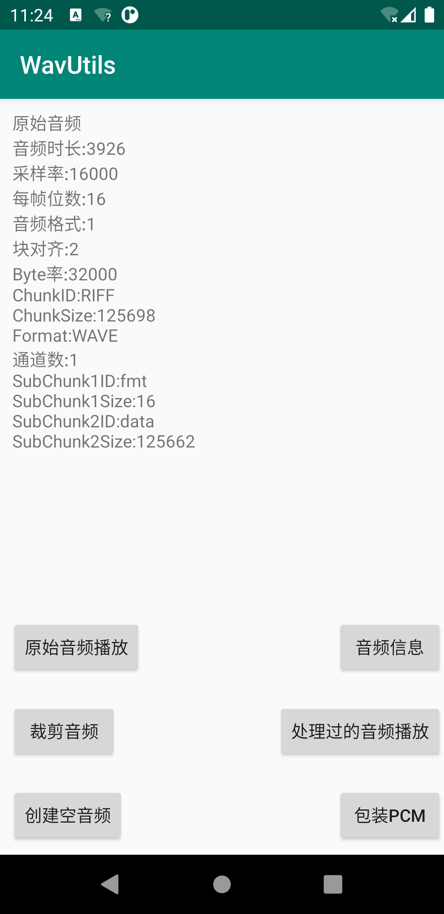

> 一个wav音频的工具库，快速读取音频信息，写音频文件



[项目地址](https://github.com/worson/WavUtils)

基础功能有：
- 读取音频信息，包括采样率、每帧位数等信息
- 写音频文件时，自动填充头信息


# 导入库到项目

根目录gradle文件下配置
```
allprojects {
    repositories {
        ...
        maven { url 'https://www.jitpack.io' }
    }
}
```
应用目录gradle文件下配置依赖
```
implementation 'com.github.worson:WavUtils:0.1'
```

# 使用方法

## 读取音频的信息
能够读取到信息如图，本质上就是通过WavFileReader来读取WavHeader的信息
```
private void showWavInfo(String tittle,String wavFilePath) {
        tv_content.setText("");
        StringBuilder sb = new StringBuilder();
        WavHeader header = WavUtil.getWavInfo(wavFilePath);
        sb.append(tittle+"\n");
        sb.append(String.format("%s:%s\n","音频时长",header.getDuration()));
        sb.append(String.format("%s:%s\n","采样率",header.getSampleRate()));
        sb.append(String.format("%s:%s\n","每帧位数",header.getBitsPerSample()));
        sb.append(String.format("%s:%s\n","音频格式",header.getAudioFormat()));
        sb.append(String.format("%s:%s\n","块对齐",header.getBlockAlign()));
        sb.append(String.format("%s:%s\n","Byte率",header.getByteRate()));
        sb.append(String.format("%s:%s\n","ChunkID",header.getChunkID()));
        sb.append(String.format("%s:%s\n","ChunkSize",header.getChunkSize()));
        sb.append(String.format("%s:%s\n","Format",header.getFormat()));
        sb.append(String.format("%s:%s\n","通道数",header.getNumChannel()));
        sb.append(String.format("%s:%s\n","SubChunk1ID",header.getSubChunk1ID()));
        sb.append(String.format("%s:%s\n","SubChunk1Size",header.getSubChunk1Size()));
        sb.append(String.format("%s:%s\n","SubChunk2ID",header.getSubChunk2ID()));
        sb.append(String.format("%s:%s\n","SubChunk2Size",header.getSubChunk2Size()));
        tv_content.setText(sb.toString());
    }
```

## 写音频文件
写wav文件使用WavFileWriter来操作，具体流程如下:

```

//定义音频信息
WavHeader header=new WavHeader(16000,1,16)

//相关位置和相关信息
WavFileWriter writer = new WavFileWriter();
writer.openFile(filePath,header);

//写入数据
byte[] buffer=new byte[2048];
writer.writeData(buffer,0,buffer.length);

//结束操作，回写信息
writer.closeFile();

```

另外提供WavUtil工具类，方便大家快速操作

